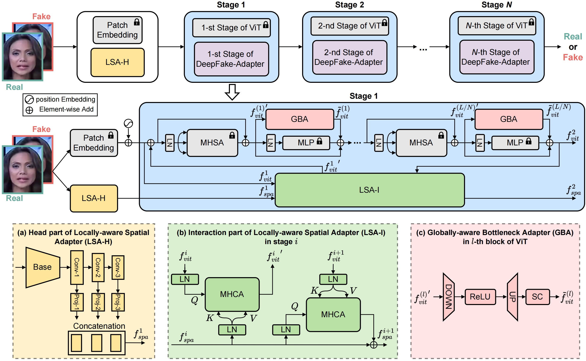
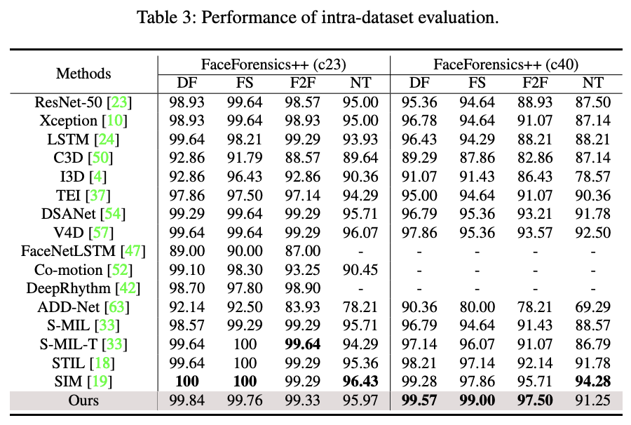
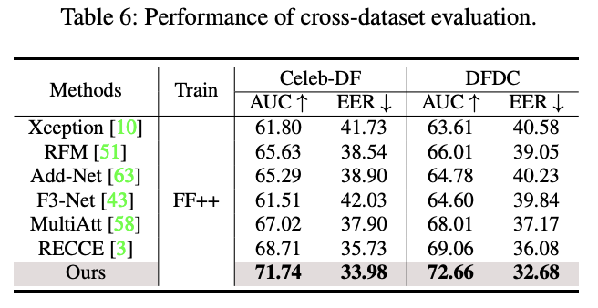
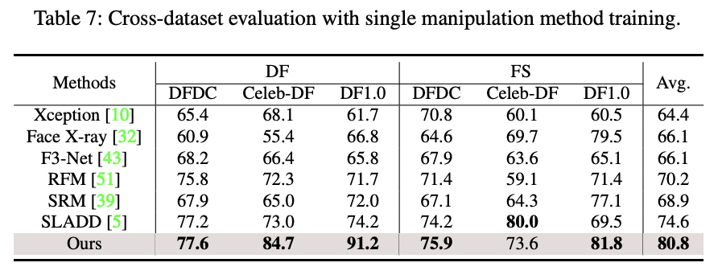
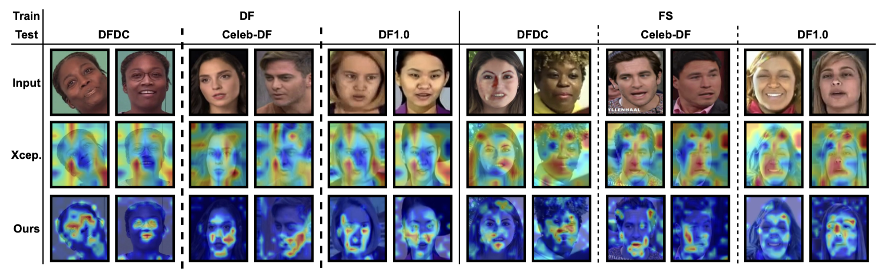
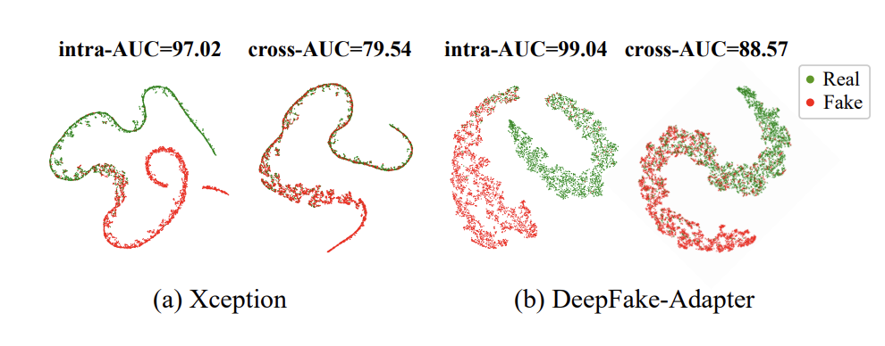

<div align="center">

<h1>DeepFake-Adapter: Dual-Level Adapter for DeepFake Detection</h1>

International Journal of Computer Vision (IJCV) 2024

<div>
    <a href="https://rshaojimmy.github.io/" target="_blank">Rui Shao<sup>1,2</sup></a>
    <a href="https://tianxingwu.github.io/" target="_blank">Tianxing Wu<sup>2</sup></a>
    <a href="https://liqiangnie.github.io/index.html" target="_blank">Liqiang Nie<sup>1</sup></a>
    <a href="https://liuziwei7.github.io/" target="_blank">Ziwei Liu<sup>2</sup></a>
</div>
<div>
    <sup>1</sup>School of Computer Science and Technology, Harbin Institute of Technology (Shenzhen)
    <br>
    <sup>2</sup>S-Lab, Nanyang Technological University
</div>

<h4 align="center">
  <a href="https://arxiv.org/pdf/2306.00863.pdf" target='_blank'>[Paper]</a>
</h4>
  
<div>
:fire: Code has released. :+1: 
</div>
<br>
  


</div>

We propose a novel DeepFake-Adapter, which is a dual-level adapter composed of Globally-aware Bottleneck Adapters (GBA) and Locally-aware Spatial Adapters (LSA). DeepFake-Adapter can effectively adapt a pre-trained ViT by enabling high-level semantics from ViT to organically interact with global and local low-level forgeries from adapters. This contributes to more generalizable forgery representations for deepfake detection.


# Updates
- [10/2024] Code and dataset are released.
- [10/2024] Accepted by International Journal of Computer Vision (IJCV) 2024.

# Installation
## Download
```shell
git clone https://github.com/rshaojimmy/DeepFake-Adapter.git
cd DeepFake-Adapter
```
## Environment
We recommend using Anaconda to manage the python environment:
```shell
conda create -n deepfake python=3.8
conda activate deepfake
conda install -y -c pytorch pytorch=1.10.0 torchvision=0.11.1 cudatoolkit=11.3
pip install -r requirements.txt
```

# Dataset Preparation
```
DeepFake
├── FaceForensicspp_RECCE
│    ├── FaceForensicspp_RECCE_c23
│    │    └── image_lists
│    │        ├── test
│    │        ├── train
│    │        └── validation
│    └── FaceForensicspp_RECCE_c40
│         └── image_lists
│             ├── test
│             ├── train
│             └── validation
├── Celeb-DF
│    ├── MTCNN_align
│    │    └── ...
│    ├── image_lists
│    │    └── xxx.csv
│    └── video
│         └── ...
└── ...
```
open `datasets/dataset.py`, copy the `DeepFake` path to the constant `YOUR_DATA_ROOT`.
For example, `DeepFake` path is `/data/path/DeepFake`, then `YOUR_DATA_ROOT='/data/path/DeepFake'`.


# Training
download the vit pretrain weights from `https://github.com/rwightman/pytorch-image-models/releases/download/v0.1-vitjx/jx_vit_base_patch16_224_in21k-e5005f0a.pth`.
```shell
mkdir pre_trained
mv jx_vit_base_patch16_224_in21k-e5005f0a.pth pre_trained
```

>! change the data path and result path in the train script

1. train model on FaceForensicspp RECCE c23/c40 all type
```shell
bash scripts/train_c23_all_type.sh
or
bash scripts/train_c40_all_type.sh
```
2. train model on FaceForensicspp RECCE c23 youtube FaceSwap or FaceForensicspp RECCE c40 youtube DeepFake, you can run:
```shell
bash scripts/train_c23_fs.sh
or
bash scripts/train_c40_df.sh
```
Feel free to modify the train script.


# Inference
test the model trained on FaceForensicspp RECCE c23 youtube FaceSwap, you can run:
```shell
bash scripts/test_c23_fs.sh
```
Feel free to modify the test script.

# Benchmark Results
Here we list the performance comparison of SOTA multi-modal and single-modal methods and our method. Please refer to our paper for more details.

<div align="center">



</div>

# Visualization Results
**Grad-CAM** visualizations in cross-dataset evaluation among DFDC, Celeb-DF and DF1.0 datasets.
<div align="center">

</div>

**t-SNE** visualization of features encoded by (a) Xception and (b) DeepFake-Adapter in intra and crossmanipulation settings. 
<div align="center">

</div>


# Citation
```
@article{shao2024deepfakeadapter,
  title={DeepFake-Adapter: Dual-Level Adapter for DeepFake Detection},
  author={Shao, Rui and Wu, Tianxing and Nie, Liqiang and Liu, Ziwei},
  journal={International Journal of Computer Vision (IJCV)},
  year={2024},
}
```

# Acknowledgements
The codebase is maintained by [Rui Shao](https://rshaojimmy.github.io/) and [Tianxing Wu](https://tianxingwu.github.io/).