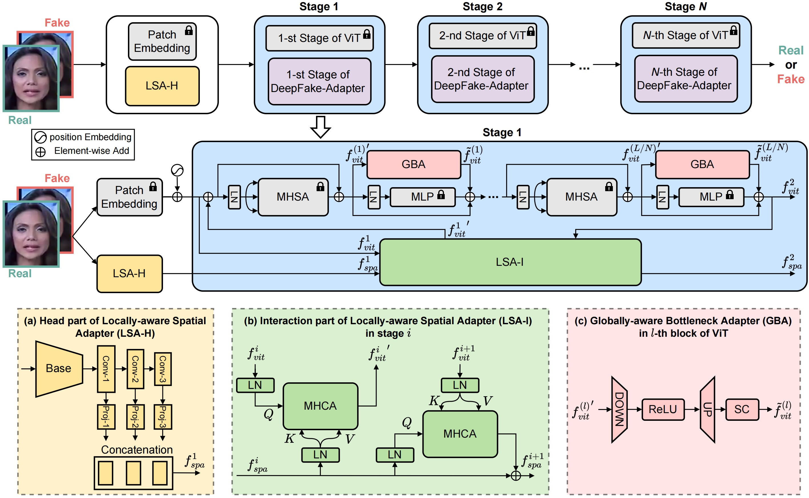

<h1>DeepFake-Adapter: Dual-Level Adapter for DeepFake Detection</h1>

    <a href="https://rshaojimmy.github.io/" target="_blank">Rui Shao1,2</a>
    <a href="https://tianxingwu.github.io/" target="_blank">Tianxing Wu2</a>
    <a href="https://liqiangnie.github.io/index.html" target="_blank">Liqiang Nie1</a>
    <a href="https://liuziwei7.github.io/" target="_blank">Ziwei Liu2</a>

    1School of Computer Science and Technology, Harbin Institute of Technology (Shenzhen)
     
    2S-Lab, Nanyang Technological University

<h4 align="center">
  <a href="https://arxiv.org/pdf/2306.00863.pdf" target='_blank'>[Paper]</a>
</h4>
  

:fire: Code will be released. Stay tuned :beers: :+1: 

 
  

We propose a novel DeepFake-Adapter, which is a dual-level adapter composed of Globally-aware Bottleneck Adapters (GBA) and Locally-aware Spatial Adapters (LSA). DeepFake-Adapter can effectively adapt a pre-trained ViT by enabling high-level semantics from ViT to organically interact with global and local low-level forgeries from adapters. This contributes to more generalizable forgery representations for deepfake detection.
